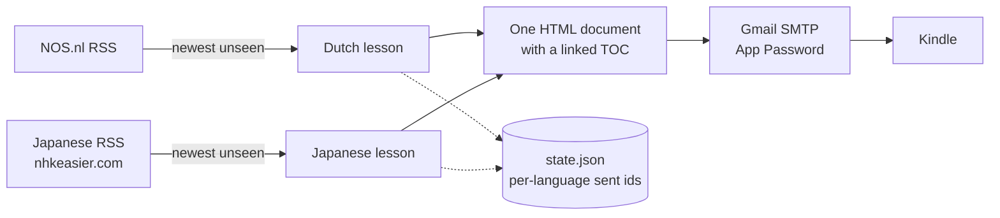

# Language Daily 🇳🇱 🇯🇵

A tiny service for your **Raspberry Pi** that emails you **one Kindle document**
containing one lesson per language — by default a real **NOS.nl** Dutch news
article and a real **Japanese** article. Each one is rewritten by AI into an
**English study breakdown** for a **total beginner (A1)**: key vocabulary, grammar
points (with kana + romaji readings for Japanese), word building, and the article
translated **paragraph by paragraph**.

The document opens with a **table of contents**, so on the Kindle you can jump
straight from Contents to the Dutch or the Japanese half — and back.



## How it works

1. **05:00 UTC** the container wakes up (picked to sit in DeepSeek's off-peak
   window — verify the window on https://platform.deepseek.com).
2. For **every language in `LANGUAGES`** it pulls that language's RSS feed and
   picks the **newest article it hasn't already sent** (`data/state.json`
   remembers per language, so you never get repeats).
3. It grabs the article text and sends it to the **LLM** (Anthropic Claude or
   DeepSeek), which produces a structured, beginner-friendly lesson **in English**.
4. All lessons are rendered into **one HTML document** with a table of contents: a
   section per language, each with vocabulary, grammar, word building and the
   article paragraph by paragraph. If one language fails (or its feed is
   exhausted), its section says so and the rest still ships.
5. The document is **emailed from your Gmail to your Kindle address** — one file,
   one email.
6. A copy of every lesson is saved to both `output/language-daily-YYYY-MM-DD.html`
   (browser) and `output/language-daily-YYYY-MM-DD.epub` (KOReader/e-readers).

## Two languages in one document

- `LANGUAGES=nl,ja` decides which languages are included and in what order
  (`nl` = Dutch, `ja` = Japanese). One language is perfectly fine too.
- The document title/ filename is `language-daily-YYYY-MM-DD.html`.
- **TOC on the Kindle:** the top of the document lists every language and its
  sections as internal links (`Contents -> Japanese -> Key Grammar Points -> and
  back`). Send-to-Kindle keeps internal links and also builds its "Go to"
  navigation from the headings, so you can jump around on the device.
- Prefer them as separate documents instead? Run the job twice with
  `--lang nl` and `--lang ja` (each run writes its own file).

## Reading it on KOReader (EPUB + OPDS)

KOReader cannot open what Amazon delivers: "Send to Kindle" converts whatever you
send — HTML, DOCX *or* EPUB — into Amazon's KFX/AZW3, and neither is in KOReader's
supported format list (PDF, DjVu, XPS, CBZ, FB2, PDB, TXT, HTML, RTF, CHM, EPUB,
DOC, MOBI, ZIP). So the daily document is also written as a **real EPUB** and
published the way KOReader likes it:

```bash
docker compose up -d --build          # starts the job + the OPDS catalog
```

On the reader: **Cloud storage → OPDS catalog → add** `http://<pi-ip>:8080/opds`.
Each day appears as an entry (`language-daily-YYYY-MM-DD`) and downloads the
EPUB; the reader's own **table of contents** then lists *Dutch → Key Vocabulary /
Grammar / Word building / Article* and the same for *Japanese*, because the EPUB
carries a proper nav + NCX built from the document anchors.

Prefer no server? Both files are always written to `output/`, so you can also just
copy the `.epub` to the device over USB/Calibre, or serve that folder with
whatever you already run (calibre-web, WebDAV, FTP, Dropbox).

Handy flags:

```bash
python -m app.opds --dir output --port 8080          # run the catalog alone
python -m app.opds --user learner --password secret  # add HTTP Basic auth
ATTACH_FORMAT=both python -m app.main --once         # email EPUB + HTML
```

Set `SEND_EMAIL=false` if you no longer want the Kindle-mail route at all.

## Japanese source

The Japanese feed is **`https://nhkeasier.com/feed/`** (an NHK News Web Easy
mirror, ~5 new stories per day). Its RSS *description* already contains the
complete easy-Japanese article with real `<p>` paragraph breaks, **furigana for
every kanji** and a slow-reading **mp3**, so nothing has to be scraped:

- the furigana is handed to the LLM as the authoritative kana reading (`[READING]`
  lines) and overrides the model's guess — which matters for irregular readings
  (20日 = はつか, not にじゅうにち);
- the mp3 is printed in the document as *Listen (slow reading)*; Kindle mail
  cannot carry audio, but the link works fine on a phone.

If the feed ever stops shipping the whole article, the job falls back to fetching
the story page and extracting its body, so it keeps working; and when the feed has
no unseen story left the Japanese section simply says *"no new article today"*
(`ALLOW_REPEATS=true` resends the newest story instead).

> nhkeasier.com is a third-party mirror of NHK's learner content — fine for
> personal study, but don't redistribute it.


## Option A: use DeepSeek instead of Claude

If you're on DeepSeek (its API is Anthropic-compatible, so the same code works):

1. Get a key at https://platform.deepseek.com/ → *API Keys* → *Create key*.
2. In `.env` set:
   ```env
   ANTHROPIC_BASE_URL=https://api.deepseek.com/anthropic
   ANTHROPIC_API_KEY=sk-<your-deepseek-key>
   CLAUDE_MODEL=deepseek-v4-pro        # or deepseek-v4-flash (cheaper/faster)
   ```
   `deepseek-v4-pro` gives the best lessons; `deepseek-v4-flash` is fine for a
   short daily article and costs less.

## Before you start — the two one-time accounts you need

1. **An LLM API key** — for writing the lessons:
   - **Anthropic**: https://console.anthropic.com/ → *API Keys* → *Create Key*, or
   - **DeepSeek** (if you use DeepSeek): https://platform.deepseek.com/ → *API
     Keys*, then follow the *Option A: DeepSeek* section above.
   Paste the key into `.env` as `ANTHROPIC_API_KEY`.

2. **A Gmail account + App Password** — for sending the email.
   - Turn on **2-Step Verification** on the Google account.
   - Google Account → **Security → App passwords** → create one for *Mail*.
   - Copy the 16-character password into `.env`.

3. **Whitelist that Gmail address in Amazon** *(critical — email is silently
   dropped otherwise)*:
   - amazon.com → **Account → Content & Devices → Preferences → Personal Document
     Settings → Approved Personal Document E-mail List → Add**
   - add your `youraddress@gmail.com`.

> 💡 Amazon delivers to `<name>@kindle.com`. If you ever want to be extra safe
> against any mobile-data delivery, also add `<name>@free.kindle.com` and send to
> that address instead (it allows Wi-Fi-only delivery).

## Install on the Raspberry Pi

Copy this whole folder to the Pi (e.g. `git clone …` or `scp`), then:

```bash
cd kp
cp .env.example .env
nano .env            # add ANTHROPIC_API_KEY, GMAIL_USER, GMAIL_APP_PASSWORD
```

Build & start it as a background service:

```bash
docker compose up -d --build
docker compose logs -f dutch-daily   # watch it work
```

The container restarts automatically (`restart: unless-stopped`) and fires once a
day at **05:00 UTC**.

## Test it immediately (before waiting for 05:00 UTC)

Check that both feeds and scrapers work (no LLM call, no email):

```bash
python -m app.main --check
```

Send one document to your Kindle right now:

```bash
docker compose run --rm dutch-daily python -m app.main --once
```

…or just build the document and **save the preview without emailing**:

```bash
docker compose run --rm dutch-daily python -m app.main --once --no-email
```

Check `output/language-daily-*.html` — open it in a browser to see exactly what
your Kindle will receive. To build only one language (or test a one-off language):

```bash
python -m app.main --once --no-email --lang ja
```

## Running without Docker (optional)

```bash
python3 -m venv .venv && source .venv/bin/activate
pip install -r requirements.txt
cp .env.example .env && nano .env
python -m app.main --once          # test run
python -m app.main &               # scheduler mode
```

## Project layout

```
kp/
├── app/
│   ├── main.py        # CLI: --once / --check / scheduler mode
│   ├── config.py      # reads .env (languages, feeds, limits)
│   ├── languages.py   # per-language profile: feed, headings, limits
│   ├── prompts.py     # the Dutch and Japanese LLM prompts + JSON schemas
│   ├── sources.py     # RSS + article text per language (NOS, Japanese)
│   ├── web.py         # shared HTTP / HTML / RSS / JSON-LD helpers
│   ├── lesson.py      # LLM call + normalising the lesson JSON
│   ├── render.py      # lessons -> one Kindle HTML document with a TOC
│   ├── kindle.py      # Gmail SMTP sender
│   ├── scheduler.py   # daily loop (05:00 UTC)
│   └── state.py       # remembers sent article ids per language
├── Dockerfile
├── docker-compose.yml
├── requirements.txt
├── .env.example       # <- copy to .env and fill in
├── data/              # state.json (kept across rebuilds via volume)
└── output/            # daily .html previews
```

Adding a language = one profile in `app/languages.py` (+ a prompt in
`app/prompts.py`) and, if its pages need special handling, one builder in
`app/sources.py`.

## Configuration reference

| Variable | Default | Purpose |
|---|---|---|
| `ANTHROPIC_API_KEY` | – | LLM API key (Anthropic **or** DeepSeek) — required |
| `ANTHROPIC_BASE_URL` | *(Anthropic default)* | Set to `https://api.deepseek.com/anthropic` to use DeepSeek |
| `CLAUDE_MODEL` | `claude-sonnet-4-5` (Anthropic) / `deepseek-v4-pro` (DeepSeek) | Model used for lessons |
| `GMAIL_USER` | – | Gmail "from" address (required to email) |
| `GMAIL_APP_PASSWORD` | – | Gmail App Password (required to email) |
| `KINDLE_EMAIL` | `yourname@kindle.com` | Destination Kindle address (comma-separate to send to several) |
| `TIMEZONE` | `UTC` | IANA zone for the schedule (use UTC so delivery is always at a fixed UTC hour) |
| `DELIVERY_TIME` | `05:00` | Daily delivery time (set to an hour inside DeepSeek's off-peak window) |
| `SEND_EMAIL` | `true` | `false` = build the files only |
| `ATTACH_FORMAT` | `epub` | What to email: `epub`, `html` or `both` |
| `LANGUAGES` | `nl` | Which languages go into the document, in order (e.g. `nl,ja`) |
| `NOS_FEED_URL` | `https://feeds.nos.nl/nosnieuwsalgemeen` | Dutch feed (per-section: `nosnieuwssport`, …) |
| `JA_FEED_URL` | `https://nhkeasier.com/feed/` | Japanese feed — nhkeasier.com (see the Japanese source section) |
| `ALLOW_REPEATS` | `false` | `true` = resend the newest article when a feed has no unseen item left |
| `MAX_ARTICLE_CHARS` | `1700` | Dutch article length fed to the LLM |
| `MAX_VOCAB` | `12` | Max Dutch vocab entries |
| `MAX_ARTICLE_CHARS_JA` | `900` | Japanese article length (characters carry more meaning) |
| `MAX_VOCAB_JA` | `10` | Max Japanese vocab entries |

## Troubleshooting

- **Nothing arrives on the Kindle** → check the Gmail address is on Amazon's
  *Approved Personal Document E-mail List* (this is the #1 cause), and confirm
  `SEND_EMAIL` isn't `false`.
- **`Gmail rejected the login`** → use an App Password, not your normal password.
- **`No items …`** → a feed is unreachable; run `python -m app.main --check` to
  see which one, then check the Pi's network/date.
- **The Japanese section is very short** → the feed is only shipping a teaser and
  a partial page body was used; check `data/state.json` and the logs from
  `python -m app.main --check`.
- **A section says "no new article today"** → that feed ran out of unseen
  articles. Add another language/feed, or set `ALLOW_REPEATS=true`.
- **Duplicates** → delete `data/state.json` to reset the "already sent" memory
  (it is stored per language now).
- **AI caveat** → grammar notes are AI-generated; spot-check important details.

## Ideas to extend later

- Switch the Dutch feed to sport/tech: `NOS_FEED_URL=https://feeds.nos.nl/nosnieuwssport`
- Add audio by including a text-to-speech clip (e.g. NOS op 3 / Google TTS) in the email.
- Send an `.epub` instead of `.html` for nicer styling.
